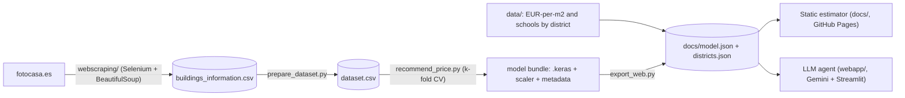

# Madrid Flat Price Estimator

End-to-end data project: **scrape** property listings from Fotocasa, **clean**
them into a dataset, **train and honestly evaluate** price-prediction models, and
ship **two front-ends** — a zero-backend static page and an LLM agent. Built for
the Master's thesis *"Categorization of real-estate properties in the city of
Madrid"* and since refactored into a small, tested codebase.

[](https://github.com/mmartinsie/webscraping-fotocasa/actions/workflows/ci.yml)
[](LICENSE)
[](pyproject.toml)
[](pyproject.toml)

## Live demos

| | What it shows |
| --- | --- |
| **[🌐 Static estimator](https://mmartinsie.github.io/webscraping-fotocasa/)** | A single HTML page (EN/ES) that runs the trained network in the browser — no backend, no build. Estimates from the district's €/m² and shows the neural network as a reference. |
| **[🤖 LLM agent](https://madrid-flat-price.streamlit.app)** *([how it works](webapp/README.md))* | Gemini + function calling with two tools (`estimate_price`, `compare_districts`). The model picks one, asks for the missing inputs, and every call/result is shown inline; the sidebar tracks turns / tokens / latency. A "Form" tab and a hand-written-loop CLI (`agent_manual.py`) round it out. |

## What this project demonstrates

- **Web scraping** — Selenium + BeautifulSoup, explicit waits, retry/backoff,
  streaming writes with `--resume`, selectors isolated as constants.
- **Data engineering** — a documented `raw → cleaned` pipeline
  ([`prepare_dataset.py`](prepare_dataset.py) + [data dictionary](keras_neural_network/DATA.md)).
- **ML with honest evaluation** — k-fold CV, non-neural baselines, target-leakage
  handling, a saved model bundle, and a [model card](keras_neural_network/MODEL_CARD.md).
  The write-up says plainly that a random forest beats the network here.
- **Two deployments from one core** — the same NumPy forward pass powers the
  static page, the CLI, and the agent tool.
- **LLM agent** — multi-tool function-calling loop (SDK-driven and a hand-written
  variant), made visible in the UI, with token/latency instrumentation.
- **Engineering hygiene** — 50+ tests, `ruff`, CI on Python 3.9/3.11/3.12,
  type hints, `make check`.

## Architecture



## Results

`finalDataset3.csv` (~8.3k flats, 30% test split), predicting `Precio` from the
5 honest features (`Precio_m2` excluded — it leaks the target):

| model | MAE | R² |
| --- | ---: | ---: |
| mean baseline | ~421k € | 0.00 |
| linear regression | ~204k € | 0.63 |
| **random forest + one-hot `Distrito`** | **~170k €** | **0.70** |
| neural net, 5 numeric + one-hot `Distrito`, 3-fold CV | ~200k € | 0.66 |
| same neural net without district | ~193k € | 0.64 |

The one-hot `Distrito` makes the network **location-aware** (its estimate moves
with the zone) at no cost to the aggregate metrics — but a plain random forest
still wins. The thesis data is ~2020, so the demos lead with a
`district €/m² × m²` estimate (~2024-2025 figures) and keep the network's output
as a secondary reference. See
[`keras_neural_network/MODEL_CARD.md`](keras_neural_network/MODEL_CARD.md).

## Repository layout

| Path | Contents |
| --- | --- |
| [`webscraping/`](webscraping/README.md) | Fotocasa scraper: `main.py` (CLI), `listing.py` (parser), `home.py` (dataclass). |
| [`prepare_dataset.py`](prepare_dataset.py) | Raw scraper CSV → model-ready dataset. |
| [`keras_neural_network/`](keras_neural_network/README.md) | `recommend_price.py` (CV + save), `predict.py`, `baseline.py`, `chat.py` (Claude CLI agent), `export_web.py`, shared `dataset.py` / `metrics.py`, [`DATA.md`](keras_neural_network/DATA.md), [`MODEL_CARD.md`](keras_neural_network/MODEL_CARD.md). |
| [`webapp/`](webapp/README.md) | Streamlit + Gemini LLM agent — `tools.py` (the two tool functions), `pricing.py` (€/m² table + NumPy forward pass, no TensorFlow), `agent_manual.py` (explicit loop). |
| [`docs/`](docs/README.md) | The static estimator (`index.html` + generated `model.json` / `districts.json`). |
| [`data/`](data/README.md) | Per-district €/m² and school-count reference tables. |
| [`neural_network/`](neural_network/README.md) | Obsolete from-scratch NumPy network, kept for reference. |
| `tests/` | Unit tests — scraper parsers, district/label parsing, metrics, dataset loading, the €/m² + NumPy forward pass, and the JS-vs-Python parity guard. |

## Quickstart

```bash
# scrape (needs Firefox + geckodriver)
cd webscraping && pip install -r requirements.txt
python main.py --pages 5 --output buildings_information.csv

# clean the raw CSV (join a schools-per-district table for the Colegios column)
python prepare_dataset.py webscraping/buildings_information.csv -o dataset.csv

# train + save a model bundle (uses the committed dataset by default)
cd keras_neural_network && pip install -r requirements.txt
python recommend_price.py --save web_model
python predict.py web_model --set Superficie=90 --set Habitaciones=3

# checks
make check        # ruff + pytest + compile
```

The static page is served straight from `docs/` (GitHub Pages → "Deploy from a
branch" → `master` `/docs`). The agent runs on Streamlit Community Cloud at
<https://madrid-flat-price.streamlit.app> (main file `webapp/streamlit_app.py`,
a `GEMINI_API_KEY` secret) — see [`webapp/README.md`](webapp/README.md).

## Screenshots

<!-- Capture from the live demos and drop the PNGs in docs/assets/. -->
| Static estimator | LLM agent |
| --- | --- |
|  |  |

## Authors ✒️

- Esther Gabay Diaz
- Adrián Camino Muñoz — [adrian98cm](https://github.com/adrian98cm)
- María González de la Llana Domarco
- Manuel Martín Sierra — [mmartinsie](https://github.com/mmartinsie)
- Miriam Ramón González — [MiriamRG13](https://github.com/MiriamRG13)

## References

- [Web scraping with Python — Edureka](https://www.edureka.co/blog/web-scraping-with-python/)
- [Ander Fernández — Neural network from scratch in Python](https://anderfernandez.com/blog/como-programar-una-red-neuronal-desde-0-en-python/)
- [Machine Learning Mastery — First neural network with Keras](https://machinelearningmastery.com/tutorial-first-neural-network-python-keras/)

## License

[MIT](LICENSE).
